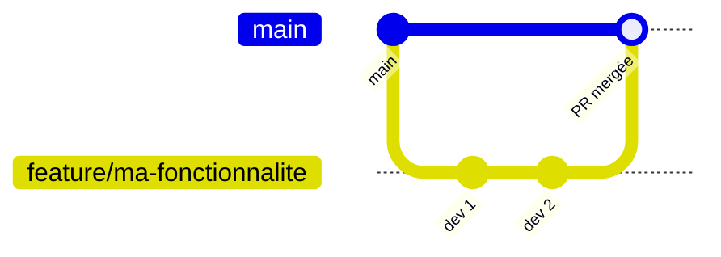

# Team Informatique - FJKM Andravoahangy Fivavahana

## Bonnes pratiques - Organisation GitHub

### Structure de l'organisation

```
TeamInfoAF/
├── .github/          ← Ce dépôt (profil + modèles)
├── fiangonana-sa/    ← Exemple : un dépôt par projet
└── …
```

- **Un dépôt = un projet** 

### Rôles et permissions

| Rôle | Qui | Droits |
|------|-----|--------|
| **Owner** | Responsables de l'équipe | Administration complète |
| **Maintainer** | Développeurs | Gestion des dépôts, revue de code, merge |
| **Member** | Développeurs | Lecture/écriture sur les dépôts assignés |

> Seuls les **Owners** et **Maintainers** peuvent fusionner sur la branche `main`.

### Nommage des dépôts

- Utiliser des noms **courts, en minuscules, avec des tirets** : `fiangonana-sa`, `site-web`
- Éviter les espaces, majuscules et caractères spéciaux
- Ajouter une description claire dans les paramètres du dépôt

---

## Flux de travail Git (Git Flow simplifié)

Nous utilisons un flux basé sur les **branches** et les **Pull Requests**.

### Branches principales

| Branche | Usage |
|---------|-------|
| `main` | Code stable, prêt pour la production - **protégée** |
| `develop` | Intégration des fonctionnalités en cours (optionnel) |
| `feature/nom-fonctionnalite` | Développement d'une nouvelle fonctionnalité |
| `fix/description-bug` | Correction d'un bug |
| `hotfix/description` | Correction urgente en production |

### Étapes pour contribuer



1. **Créer une branche** à partir de `main` :
   ```bash
   git checkout main
   git pull origin main
   git checkout -b feature/ajout-import-excel
   ```

2. **Développer et committer** avec des messages clairs :
   ```bash
   git add .
   git commit -m "feat: ajouter l'import Excel des élèves"
   ```

3. **Pousser** la branche sur GitHub :
   ```bash
   git push -u origin feature/ajout-import-excel
   ```

4. **Ouvrir une Pull Request (PR)** vers `main` et demander une revue

5. **Fusionner** après approbation d'au moins **1 reviewer**

6. **Supprimer** la branche après le merge

### Convention de commits

Nous suivons le format [**Conventional Commits**](https://www.conventionalcommits.org/fr/) :

| Préfixe | Usage | Exemple |
|---------|-------|---------|
| `feat:` | Nouvelle fonctionnalité | `feat: ajouter la page de connexion` |
| `fix:` | Correction de bug | `fix: corriger l'affichage des notes` |
| `docs:` | Documentation | `docs: mettre à jour le README` |
| `refactor:` | Refactoring sans changement fonctionnel | `refactor: simplifier le service API` |
| `test:` | Ajout ou modification de tests | `test: ajouter tests unitaires import` |
| `chore:` | Tâches diverses (config, dépendances…) | `chore: mettre à jour les dépendances` |

---

## Règles des Pull Requests

### Avant d'ouvrir une PR

- [ ] Le code compile / s'exécute sans erreur
- [ ] Les tests passent (si applicable)
- [ ] Le code respecte les conventions du projet
- [ ] La branche est à jour avec `main`

### Contenu d'une bonne PR

- **Titre** : court et descriptif (`feat: import Excel des moniteurs`)
- **Description** : expliquer le *pourquoi* et le *quoi*
  - Contexte / problème résolu
  - Changements principaux
  - Captures d'écran (si changement visuel)
  - Instructions de test

### Revue de code

- Chaque PR doit être **revue par au moins 1 membre** avant merge
- Les commentaires doivent être **constructifs et respectueux**
- Le reviewer peut : **Approuver**, **Demander des modifications**, ou **Commenter**
- L'auteur corrige les remarques, puis re-demande une revue si nécessaire

### Protection de la branche `main`

> **Paramètres → Branches → Add branch protection rule → `main`**

---

## Sécurité

- **Ne jamais** committer de mots de passe, clés API ou fichiers `.env`
- Utiliser un fichier **`.gitignore`** adapté à chaque projet

---

## Ressources utiles

- [Documentation GitHub - Organisations](https://docs.github.com/fr/organizations)
- [GitHub Flow](https://docs.github.com/fr/get-started/using-github/github-flow)
- [Conventional Commits (FR)](https://www.conventionalcommits.org/fr/)
- [Git - Guide de démarrage](https://git-scm.com/book/fr/v2)

---

<p align="center">
  <strong>FJKM Andravoahangy Fivavahana - Team Informatique</strong><br>
</p>
